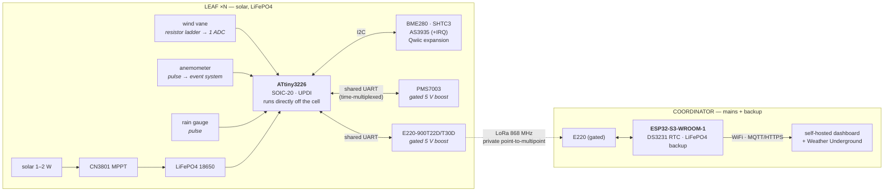
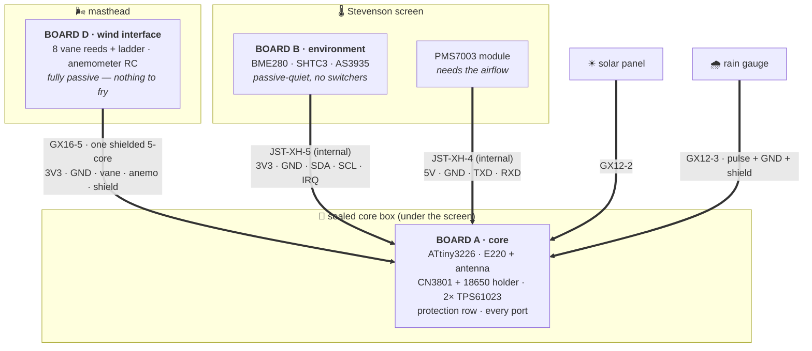

# Forsyth — Hardware Architecture

**Status:** planning document, v1 — 11 July 2026
**Scope:** component-level architecture, power design, and layout guidance. **No PCB
CAD lives here** — schematics, layouts, and footprints are done by hand (Anish) in KiCad;
this document is the reference to design against.

Companion documents: [BOM.md](BOM.md) (parts + India sourcing),
[../research/competitive-landscape.md](../research/competitive-landscape.md) (datasheet
numbers with sources), [../cloud/](../cloud/) (the server the coordinator talks to —
HTTP `POST /api/v1/ingest` with a bearer key, or MQTT `forsyth/<slug>/reading`; see
[../cloud/docs/deploy.md](../cloud/docs/deploy.md)).

---

## 1. System overview

*(Rendered natively by GitHub; the printable system diagram lives at
[diagrams/leaf-system.svg](diagrams/leaf-system.svg).)*



- **Topology:** private point-to-multipoint LoRa. Leaves speak only to the coordinator;
  the coordinator timestamps on receipt and uploads. No multi-hop routing in v1 (payload
  schema leaves room for it, §7).
- **Not LoRaWAN — documented decision.** The Ebyte "D" modules run Ebyte's own UART
  protocol over a LoRa radio, not the LoRaWAN MAC. For a single-owner mesh this is
  simpler and sufficient. If TTN/Helium interop is ever wanted, that is a different radio
  firmware stack (or module), not a config change — noted here so it's a choice, not an
  accident.
- **Module family: Ebyte E220 (LLCC68) — decided 2026-07-12,** superseding the brief's
  E22 (SX1262). What's traded away: SF12 (LLCC68 tops out at SF11 — ~one SF step less
  extreme-range headroom) and the E22's relay-network feature (an explicit non-goal
  anyway). What's gained: current-generation silicon, lower cost, a 200-byte packet cap
  that matches the payload schema in §7 — and, decisively, **lokki runs this exact
  family**, so its debugged register map, config sequences, and AUX discipline
  (`../../lokki/firmware/micropython/src/comms/`) are a direct working reference rather
  than an analogy. Everything in this section (gating, AUX two-edge, M0/M1 weak
  pull-ups, 3.3 V fixed logic, "≥5.0 V ensures output power") is confirmed in the E220
  manuals and applies unchanged.

---

## 2. Leaf node

### 2.1 MCU — ATtiny3226 (tinyAVR-2, SOIC-20, UPDI)

Decided, with rationale recorded:

- Genuine wide **SOIC-20** (1.27 mm pitch) — hand-solderable, no adapter needed; the bare
  chip goes directly on the leaf PCB. No breakout/carrier module exists that solves the
  one hard problem (raw-LiFePO4 power path), so a module would add cost without removing
  design work.
- **UPDI** single-wire programming (existing programmer on the bench; SerialUPDI from any
  USB-serial adapter + one resistor is the fallback recipe).
- 32 KB flash / **3 KB SRAM** — more SRAM than an ATmega328P; headroom is real.
- **Integrated RTC on the internal 32.768 kHz ULP oscillator** — ±10 % raw, calibratable
  to ±2 %; ample for periodic wake intervals since the coordinator timestamps on receipt.
  **No external crystal, no crystal pins, no external RTC on the leaf.**
- **Event System + TCB** counts anemometer pulses in hardware while the CPU sleeps; the
  CPU wakes to read an accumulated count, not on every rotation.
- Classic ATmega328P is disqualified on package alone (no SOIC variant exists — PDIP-28,
  TQFP-32, QFN-32 only, per Microchip ordering info). The 14-pin ATtiny3224 is one GPIO
  too tight once AQI is included. megaAVR-0 (ATmega4808, 3 hard UARTs, SSOP-28) is the
  escape valve if shared-UART multiplexing ever proves painful — known, not planned.
- **Cross-check against lokki (done, 2026-07-11):** lokki runs MicroPython on an RP2350
  (Pico 2/2 W) — different architecture, different language, zero toolchain overlap
  either way. Reuse from lokki is *patterns* (AUX two-edge discipline, wire-key payload
  style), not code. No reason to displace the ATtiny3226. User confirmed.

**Pin budget (18 GPIO available on SOIC-20):**

| Function | Pins |
|---|---|
| I2C (SDA/SCL): BME280, SHTC3, AS3935, expansion | 2 |
| Shared UART (TX/RX): E220 + PMS7003, time-multiplexed | 2 |
| E220 control: M0, M1, AUX (in), power-gate EN | 4 |
| PMS7003 power-gate / boost EN | 1 |
| Wind speed pulse (Event System input) | 1 |
| Wind direction ADC (resistor ladder) | 1 |
| Rain gauge pulse | 1 |
| AS3935 IRQ | 1 |
| Battery voltage ADC (divider, high-side switched) | 1 |
| **Total** | **14** |
| Spare (future display, second gate, debug) | 4 |

### 2.2 Sensor suite

| Quantity | Sensor | Interface | Notes |
|---|---|---|---|
| Wind speed | magnet + reed switch | pulse → Event System | RC debounce at connector (§8) |
| Wind direction | magnet + 8 reed switches | **1 ADC pin, resistor ladder** | see below |
| Rain | tipping bucket + reed | pulse | same debounce pattern as wind |
| Pressure | BME280 | I2C | **pressure only** — see decision below |
| Temp/RH | SHTC3 or SHT4x | I2C | owns ambient temp + humidity |
| Particulates | Plantower PMS7003 | UART (shared), own gated 5 V boost | 30 s warm-up before valid data |
| Lightning | DFRobot SEN0290 (AS3935) | I2C + IRQ | **never duty-cycled**; 60–80 µA listening |

**Temp/humidity decision (made, 2026-07-11):** BME280's humidity element has a small
reconditioning heater and the module runs slightly warm in an enclosure — a known warm
bias in outdoor builds. **Forsyth uses the BME280 for pressure only and pairs it with an
SHTC3/SHT4x for ambient temp/RH.** Costs ~₹150–250 and one more I2C address per leaf;
worth it for a station whose entire personality is being right. (SHTC3 domestic stock is
the least certain item on the BOM — verify before ordering; SHT40 breakouts are an
equivalent substitute.)

**Wind direction — resistor ladder:** each of the 8 reed switches is in series with a
distinct resistor; all common to one ADC pin. Direction reads as one analog voltage;
the mast cable drops to **power / ground / signal(s)** instead of 8+ cores. Choose ladder
values so that adjacent-switch overlap (vane between two reeds closing both) still
produces a distinguishable voltage — E12-series values spread roughly logarithmically,
verified on the bench, is the standard trick. *Upgrade note:* an AS5600 magnetic angle
sensor (I2C, contactless, ~12-bit) is a plausible future drop-in on the expansion I2C
bus. Nothing in the architecture may preclude it — and nothing does: it's one more I2C
address on a bus that auto-detects (§7).

**AS3935 siting (decided):** the antenna is layout-sensitive and dislikes switching
noise. It lives on **Board B in the Stevenson screen** (§6), a cable-length away from
the core board's boost converters — isolation by partition. SEN0290's tuned antenna
preferred over untuned clones; jigawatt's experience (see `../../jigawatt/README.md`)
says the same.

### 2.3 Shared UART — PMS7003 and E22, time-multiplexed

One hardware UART serves both, because the two are **never on at the same time** — each
is behind its own power gate, and the wake cycle sequences them:

```
wake → read I2C sensors + pulse counters
     → gate PMS7003 boost ON → wait 30 s warm-up → read frame(s) over UART → gate OFF
     → gate E220 boost ON → (radio sequence, §3) → transmit → gate OFF
     → sleep
```

This is not just a pin-count trick; it's the same always-power-gated discipline the
radio needs anyway, applied uniformly. Bus contention is impossible when only one device
is powered. (If AQI cadence should ever need to differ from met cadence — PM readings
cost ~35× a LoRa burst in energy, see §5 — the schedule can simply skip the PMS7003 leg
on most wakes; nothing about the sharing changes.)

---

## 3. LoRa integration & power gating — the lokki lesson, made law

lokki's E220 (same M0/M1/AUX family, LLCC68 vs SX1262) took **60–100 s after power-on**
before register writes were reliable. Diagnosis, from lokki's own commit history
(`b4d5037`, `ce33ac9`, `9dbeab4` in `../../lokki`) and ROADMAP:

1. **No bulk capacitance at the module's V+** — fed straight from an LM2596 buck;
   switching ripple + cold-start cap-charge transient + the module's internal-LDO warm-up
   corrupted borderline-timing register exchanges. (The same module on a clean USB supply
   worked first try, every time.)
2. **Non-atomic M0/M1 GPIO init** — pins driven OUT before being driven LOW glitched the
   module through a hidden mode bounce. The E220 manual confirms M0/M1 have **weak
   pull-ups**: floating pins = M0=M1=1 = deep sleep. During MCU reset, tri-stated pins
   float high. Drive them, always, from before the module has power.
3. **Blind delays instead of AUX edges** — the fix that worked was a two-edge wait
   (AUX LOW = module processing, AUX HIGH = done), not longer sleeps.
4. **The module was never power-gated** — permanently on the 5 V rail, so a bad state
   persisted until someone cycled power by hand.

Forsyth's requirements (non-negotiable, applies to **both** leaf and coordinator):

1. **Full power gating — implemented as a boost converter with true load disconnect.**
   The E22's 5 V rail comes from its own boost stage whose **EN pin is the power gate**,
   driven by a dedicated GPIO (decided 2026-07-11, superseding the earlier separate
   load-switch + boost-module pair). In sleep the module is **off** — not in M0/M1
   sleep mode, unpowered. No state to go stale, no lesson to relearn.

   **The trap this design must avoid:** a generic boost converter is *not* a power
   switch. Most boosts (including the MT3608-class chips on common breakout modules)
   have a **pass-through path when disabled** — input stays connected to output through
   the inductor and the rectifier, so "EN low" leaves ≈ V_batt − V_diode ≈ **2.6–2.9 V**
   on the rail. The E220-900T22D operates down to **3.0 V** and the radio family generally below that (manual, §3.4 sources) — a
   "disabled" generic boost therefore leaves a brown-powered zombie radio, which is the
   lokki failure mode wearing a new hat. Hence the rule: **the boost IC must provide
   true load disconnect** (output isolated from input in shutdown), or a discrete
   high-side switch must sit *upstream of the boost's input*.

   - **Default part: TI TPS61023.** Datasheet-confirmed true disconnect — "during
     shutdown the output is completely disconnected from the input" with **0.1 µA**
     shutdown current; input 0.5–5.5 V (LiFePO4's 2.5–3.65 V well inside); output
     adjustable 2.2–5.5 V; **≥3 A valley switch current limit** — comfortably clears the
     ≥1.3 A input-side requirement for a T30D burst (§3.4/§3.5).
     Source: [TPS61023 datasheet (TI)](https://www.ti.com/lit/ds/symlink/tps61023.pdf).
     **Use the bare IC (decided 2026-07-11; available on Robu per Anish).** The 7semi/
     Evelta breakout was considered and rejected: it **masks the EN pin** (strapped to
     VIN), which deletes the one feature this chip was chosen for. Caveat that stands:
     SOT-563 (0.5 mm pitch) is the design's one fine-pitch part — flux, drag-solder,
     magnification, and a couple of practice runs on the first board.
   - **Discrete fallback (all parts Robu-stocked):** P-channel MOSFET high-side switch
     (AO3401/SI2301 class, SOT-23, ₹3–7, gate-drivable from 2.5 V —
     [Robu listing](https://robu.in/product/ao3401-hxy-mosfet-30v-4-2a-1-2w-54m%CF%8910v4-2a-700mv-1-p-channel-sot-23-3l-mosfets-rohs/))
     + small NFET/2N7002 level driver, gating the **input** of whatever boost follows.
   - **Not acceptable:** TPS22918 (fine part, but not stocked domestically — checked
     Robu 2026-07-11); MT3608-style boost modules as gates (pass-through); and
     **TPS2041(B) on the radio rail** — it's a 500 mA-continuous USB switch with a
     0.75–1.25 A current limit
     ([datasheet](https://download.mikroe.com/documents/datasheets/TPS2041B_datasheet.pdf)),
     which a 650 mA-typ T30D burst would trip or brown out. It *is* acceptable on the
     PMS7003 rail (~100 mA max) — see §5.
2. **Wake sequence, every cycle, not just cold boot:**
   ```
   drive M0/M1 to the intended mode (outputs LOW/defined BEFORE power-en)
   → assert power-enable → wait rail settle (ms, per boost + bulk cap)
   → wait AUX HIGH (module self-check done; datasheet: wait the rising edge)
   → +2 ms guard (datasheet: mode effective after AUX high ≥2 ms)
   → UART traffic (config write if needed, then payload)
   → wait AUX LOW→HIGH two-edge (TX accepted → TX complete), + small guard
   → de-assert power-enable → sleep
   ```
3. **Bulk capacitance after the gate:** 100–220 µF low-ESR + 100 nF ceramic **at the
   module's VCC pin, downstream of the gated boost stage** (so it powers off with the
   module and still absorbs the TX burst). This is the component lokki's Rev0 board was
   missing.
4. **Current sizing — real numbers from the E220 manuals (module decision below):**
   - E220-900**T30D**: TX current **620 mA typ** (instantaneous) at 30 dBm; RX 17.2 mA;
     sleep 5 µA; operating voltage 3.0–5.5 V, **"≥5.0 V ensures output power."**
   - E220-900**T22D**: TX current **110 mA typ** at 22 dBm; RX 16.8 mA; sleep 5 µA;
     same voltage row.
   - Applying the ≥2× datasheet-peak rule: **T30D ⇒ ≥1.25 A momentary (design target
     stays 1.3 A); T22D ⇒ ≥250 mA.** The TPS61023 stage covers both unchanged.
   *(Historical: the earlier E22/SX1262 numbers were 650/140 mA — same sizing either way.)*
5. **5 V boost rail for the E22** (own gated boost, same pattern as the PMS7003): the PA
   runs at the top of its supply range, which the manual explicitly ties to delivering
   rated output power — this matters most for the T30D. **Boost converters reflect
   power, not current:** a 5 V × 650 mA burst is ≈ 3.25 W, which at a 3.2 V battery node
   and ~85 % efficiency is ≈ **1.2 A momentary from the LiFePO4 side**. Size the
   input-side bulk capacitance, the CN3801 output cap, and the cell's discharge rating
   for that input-side figure, not the 5 V figure.
6. **Logic levels:** the manual states communication level is **3.3 V regardless of VCC**
   (module has its own internal regulator for logic) and only warns 5 V-TTL hosts to add
   level conversion. The ATtiny3226 at 3.3 V connects directly — no shifter. Caveat for
   the record: the manual gives no numeric Vih/Vil table, so this is confirmed at
   user-manual level; if a silicon-threshold answer is ever needed, measure or ask Ebyte.
7. **T30D vs T22D per node type — recommendation (confirm before ordering):** default
   leaves to **T22D** (4.6× smaller TX burst, easier power path, 22 dBm is generous for
   line-of-sight km with decent antennas); reserve **T30D** for the worst RF path — a
   leaf behind terrain, or the coordinator if uplink symmetry matters. Both variants are
   drop-in identical in footprint and protocol, so the choice can be per-site.

---

## 4. Coordinator

- **MCU: ESP32-S3-WROOM-1** (module, not bare chip — RF matching done). Dual-core: one
  core services the E22 UART link without ever blocking on TLS; the other runs
  WiFi/MQTT/HTTPS and the Weather Underground uploader.
- **RTC: DS3231** (I2C) — survives reboots, bridges NTP outages, allows local
  timestamping if the uplink is down. The coordinator is the mesh's clock; leaves don't
  keep wall time at all.
- **LoRa:** same E22 module, same gating circuit, same wake discipline as the leaf
  (§3.7 of the brief: consistency avoids a second class of bugs, and an unpowered radio
  is an RF-quiet radio). The coordinator's radio is on far more often (it listens), so
  "gated" here means *gateable* — bring-up sequencing and recovery power-cycles under
  MCU control, not duty-cycled sleep.
- **Power:** mains (USB-C 5 V) + battery backup sized for **hours, not weeks** — a small
  LiFePO4 pack for chemistry-consistency with the leaves (one charger design to
  understand, one cell type to stock), with an appropriate charge/boost path. Chemistry
  formally open per the brief; LiFePO4 is the default absent a reason otherwise.
- Timestamps on receipt; leaf packets carry sequence numbers, not clock time.

---

## 5. Power budget — methodology (numbers TBD with real firmware)

Average current:

```
I_avg = (I_sleep × T_sleep + Σ I_active_phase × T_phase) / T_total
```

**What is known now (datasheet-level, sourced in research/competitive-landscape.md):**

| Contributor | Current | Duration / duty | Note |
|---|---|---|---|
| AS3935 listening | 60–80 µA | **continuous** | cannot be duty-cycled; the dominant *sleep-term* line item, larger than the MCU asleep |
| ATtiny3226 sleep (RTC on ULP osc) | ~1 µA class | continuous | verify on bench |
| CN3801 sleep path (BAT + CSP pins) | ~8 µA | continuous (panel dark) | datasheet §sleep; series diode D1 blocks the additional ~18 µA body-diode back-feed — keep D1 populated |
| Battery-sense divider | ~2.7 µA | continuous | 1 M + 330 k (board sheet §3.4) |
| BME280 / SHTC3 idle | ~0.1–1 µA each | continuous | negligible |
| PMS7003 reading | ~80 mA at 5 V (boost input side higher) | ~30 s per reading | **the dominant active-term item: ≈0.67 mAh per reading — ~35× one LoRa burst** |
| E220 T22D TX | 110 mA at 5 V | <1 s | ≈0.015 mAh per report |
| E220 T30D TX | 620 mA at 5 V | <1 s | ≈0.09 mAh per report; sizing case, not energy case |
| MCU awake + I2C reads | ~few mA | ~1 s | small |

**Consequences already visible without fabricated precision:**
- The sleep budget is an **AS3935 problem** (~0.07 mA floor ⇒ ~1.7 mAh/day before
  anything else happens).
- The active budget is a **PMS7003 problem**: at hourly AQI readings, ~16 mAh/day — an
  order of magnitude above everything else combined. AQI cadence is the single biggest
  battery-life knob on the leaf. (Met readings can run more often than AQI; the shared
  UART schedule already permits this, §2.3.)
- A 1500 mAh LiFePO4 18650 therefore holds **weeks of autonomy** with zero sun on any
  sane schedule — but publish no figure until firmware currents are measured. A
  worked spreadsheet (`power-budget.ods` or `.md` table) belongs here **after** bench
  measurements; placeholder intentionally left, per the brief.
- Solar: 1–2 W **6 V-class** panel (V_MP ≈ 6 V, Voc ≈ 7.2 V) into the CN3801 — its
  UVLO can sit as high as 4.4 V and charging needs VCC > V_BAT + 0.32 V (datasheet),
  so 5 V panels are marginal under load. Sized for the worst realistic season
  (monsoon overcast) — to be checked against the measured I_avg, not guessed.

**Leaf charging — CN3801 (decided).** Consonance's LiFePO4-native sibling of the CN3791:
same MPPT solar-buck topology, CV point **fixed at 3.625 V ±40 mV at the factory** —
no resistor-divider retargeting, unlike the 4.2 V-fixed CN3791 breakouts common in the
Indian market (wrong chemistry). SOP-8, hand-solderable, already on hand.

**Two gated 5 V boost rails on the leaf** (PMS7003, E22) — both fully off between uses,
each implemented as a **boost-with-true-load-disconnect stage, EN driven by the MCU**
(§3.1): TPS61023 on the radio rail (sized for T30D), and either a second TPS61023 or a
cheaper boost + TPS2041B switch on the AQI rail (PMS7003 draws ≤100 mA — inside the
TPS2041B's 500 mA rating). One GPIO per rail either way; the pin budget in §2.1 is
unchanged. Nothing on a Forsyth leaf is powered while idle except the MCU's sleep
domain, the two I2C ambient sensors, and the AS3935 doing its one perpetual job.

---

## 6. Boards, enclosures & interconnect (partition decided 2026-07-11)

Feature modularity is a **PCB and protocol** concern, not an excuse for more MCUs.
The physical reality of a station: a **Stevenson screen** holding the quiet sensors, a
**sealed core box** below it, wind instruments at the **masthead**, a **rain gauge** on
its own stand, and a **solar panel** on a bracket. The PCB partition follows that:



> Per-board reference sheets (pin maps, sub-circuits with sourced values, designator
> BOMs, bring-up checklists) live in **[boards/](boards/README.md)**.

**Board A — core** (the only board with switching regulators): MCU, radio, battery,
charging, both gated boosts, TVS/protection, and every connector. One design, every
leaf. The 18650 holder is on-board — no battery cable to get wrong.

**Core box siting — decided 2026-07-12: a separate sealed box, *not* the screen's
floor.** The board dissipates ~0.1–0.3 W while charging (worst at peak sun) plus TX
bursts; a box forming the screen's bottom cap would feed that plume straight into the
louvre intake — worst on calm sunny days, when radiation error is already largest
(shield self-heating studies: 0.1–0.2 W ⇒ +0.1–0.5 °C in calm air). Mount the box on
the mast **below and offset ~30–50 cm** from the screen, shaded side. Side benefits:
cooler battery (LiFePO4 calendar life), antenna clear of the screen. Consequence: the
Board-B and PMS runs cross open air — they become **glanded fixed pigtails** (XH
connectors inside each enclosure, after the gland), *not* additional GX connectors,
which would collide with the pin-count keying. The wake order already reads temp/RH
before the PMS fan spins, so the screen's own transient heat source is sequenced away.

**Board B — environment** (inside the screen): BME280 + SHTC3 + AS3935 on the I2C bus
plus the AS3935 IRQ line. **This is why the MCU does *not* live in the screen:** the
AS3935's application notes want distance from switching noise, and the two boost stages
+ CN3801 are unavoidable neighbours of the MCU's board. Putting B on a short cable buys
that isolation for free, keeps the I2C run short (≤0.5 m, well within spec at 100 kHz
with 4.7 kΩ pullups), and keeps the screen containing only quiet, passive-supply parts.
The PMS7003 mounts beside it in the screen (it needs the airflow) with its own pigtail
back to the core's gated 5 V port.

**Board D — wind interface** (masthead junction, fully passive): the vane's 8 reeds +
resistor ladder, the anemometer input's RC debounce, everything commoned onto **one
5-core shielded run** down the mast. No silicon up top, nothing to fry.

**Rain gauge**: bare reed + magnet on the tipping bucket; its RC debounce lives on
Board A at the connector (per §8) — the gauge end stays a dumb switch.

### 6.1 Interconnect — connector scheme

Connector options considered:

| Option | Pros | Cons | Verdict |
|---|---|---|---|
| **RJ11/RJ12** (user's question) | dirt cheap, latching, tools everywhere | every jack identical → nothing stops the vane cord going into the rain port; flat cords crimped straight *or* reversed (power-pin roulette); unshielded (analog ladder + I2C pickup); oxidizes outdoors | bench prototyping only — **not for the mast** |
| RJ45 + one universal pinout | 8 cores, cheap shielded cat5e, mis-plug survivable if every port shares one pinout | still not weatherproof without housings; universal pinout wastes cores; couplers corrode | acceptable indoor fallback, second choice |
| JST-XH (keyed, polarized) | cheap, Robu-ubiquitous, can't reverse, sizes differ by pin count | not weatherproof, not panel-mount — internal use only | **chosen for inside-the-box harnesses** |
| M12 circular (industrial) | IP67, keyed, the "correct" answer | ₹250–400 per mated pair × 6+ positions; overkill | if the budget ever allows |
| **GX12/GX16 aviation connectors** | metal, screw-locking, panel-mount, ₹40–90 on Robu/Sharvi, and **pin count = physical key** | splash-resistant not IP67 (mount facing down + boot) | **chosen for all external runs** |

**The mis-plug defence is pin count.** Every external cable gets a *different* GX size,
so no wrong connection can physically mate:

| Run | Connector | Cores | Pinout |
|---|---|---|---|
| Solar panel → core | **GX12-2** | 2 | 1 = panel +, 2 = panel − (reverse-polarity protected on board anyway, §8) |
| Rain gauge → core | **GX12-3** | 2 + shield | 1 = pulse, 2 = GND, 3 = shield/spare |
| Masthead (Board D) → core | **GX16-5** | 5, shielded | 1 = 3V3 excitation · 2 = GND · 3 = vane analog · 4 = anemometer pulse · 5 = shield |
| Board B ↔ core (box→screen, **glanded pigtail**, XH-5 inside each enclosure) | **JST-XH-5** + 2 glands | 5 | 3V3 · GND · SDA · SCL · AS3935-IRQ |
| PMS7003 ↔ core (box→screen, **glanded pigtail**, XH-4 inside) | **JST-XH-4** + gland | 4 | gated 5 V · GND · TXD · RXD (SET strapped high at the sensor) |
| Expansion (future daughter boards) | Qwiic/JST-SH-4 | 4 | 3V3 · GND · SDA · SCL — the standard stays |

Rules that keep future-you honest: **GND on pin 2 of every GX connector**; every
external line enters Board A through its TVS + series-R row (§8); all GX sockets mounted
on the box's underside; silkscreen + engraved labels at both ends of every cable; cable
= outdoor UV-stable shielded multicore (security/alarm cable is cheap and fine — the
longest run carries one analog level and one slow pulse train, not ethernet).

Worst realistic mistakes, walked through: solar into rain (won't mate, 2≠3); masthead
into anything else (won't mate, 5-pin); swapping the two *internal* XH harnesses (won't
mate, 4≠5); reversing any JST (polarized shell, can't). The one surviving hazard is
miswiring inside a plug during assembly — mitigated by the GND-always-pin-2 rule and
the protection row behind every port.

### 6.2 Growth path

- Anything I2C (display, AS5600 vane upgrade, soil moisture) rides the Qwiic expansion
  or Board B's bus; anything pulse-shaped follows the rain-gauge pattern on a spare GPIO
  and, if external, gets the next unused GX size (GX12-4).
- **Firmware auto-detects population** by I2C scan at boot and builds its payload
  accordingly (§7). A leaf with no AQI sensor is still a station; a leaf can grow senses.

---

## 7. LoRa payload schema (documented now, implemented later)

LoRa payloads are small and airtime is precious; the packet must describe itself rather
than assume full sensor population.

```
byte 0      : schema version (upper 4 bits) | flags (lower 4 bits)
byte 1      : leaf id (1–255; coordinator = 0)
byte 2      : sequence number (wraps; coordinator detects gaps)
byte 3–4    : sensor-presence bitmask (little-endian), one bit per field group:
              bit 0  temp (SHTC3)          bit 6  wind gust
              bit 1  humidity              bit 7  rain count
              bit 2  pressure (BME280)     bit 8  PM1/PM2.5/PM10
              bit 3  battery voltage       bit 9  lightning events
              bit 4  wind speed avg        bit 10 solar/charge state
              bit 5  wind direction        bits 11–15 reserved
byte 5…     : field groups, in bit order, fixed-width scaled integers each
              (e.g. temp: int16 centi-°C; pressure: uint16 = Pa/10 − 30000;
               PM: 3 × uint16 µg/m³; lightning: uint8 count + uint8 nearest-km)
```

- **Routing headroom:** flags bits are reserved for a future hop/TTL nibble, and leaf id
  0 is reserved for the coordinator — enough space that adding relay metadata later is
  an extension, not a redesign. (Explicit non-goal now.)
- Transport addressing (E220 fixed mode `[ADDH][ADDL][CHAN]` prefix, ≤200-byte payloads,
  optional trailing RSSI byte) follows the same conventions lokki proved out — see
  `../../lokki/docs/lora-protocol.md` for the working precedent.
- The coordinator ACKs configuration pushes only; routine reports are fire-and-forget
  with gap detection via sequence numbers.

---

## 8. Layout notes (for the KiCad pass — guidance, not CAD)

- **Decoupling:** 0.1 µF ceramic at every IC power pin, closest component to the pin,
  short low-inductance ground return; one per pin on multi-VDD packages, never shared.
  1–10 µF bulk near each regulator output and each dense IC cluster.
- **The gated bulk cap goes after the gate:** the 100–220 µF + 100 nF from §3.3 sits
  **downstream of the boost stage, at the E22's VCC pin** — upstream it would stay
  energized in sleep and do nothing for the TX burst. Same rule for the PMS7003's
  bulk cap on its rail. (With the TPS61023's load disconnect, "downstream of the boost
  output" is automatically downstream of the gate.)
- **Boost-stage integration** (now that the converters are on-board, not modules):
  keep the power loop tight — input cap, IC, inductor, output cap in minimum area;
  the switch node (SW pin ↔ inductor) as short and small as possible; the FB divider
  and its trace routed away from the inductor and switch node; a solid ground pour
  under the stage stitched to the plane. Per the TPS61023 datasheet layout guidance;
  both boost stages live away from the AS3935 and the ADC ladder (see below).
- **Ground plane:** solid, unbroken under the RF section; no routed traces slicing the
  plane under the E220 or the antenna feed.
- **RF trace:** module-to-antenna short and at the E220 app-note's controlled impedance
  for the chosen stack-up; no digital lines near or under it; component/pour keep-out
  around the antenna.
- **Crystals:** the leaf has none (internal ULP oscillator — that's the point). The
  coordinator's DS3231 has its crystal integrated. If any discrete crystal ever appears,
  short symmetric traces, load caps per datasheet, guard ring, away from switchers/RF.
- **Reed inputs:** ~1 kΩ series + 10–100 nF to ground at each reed input, **right at the
  connector** — outdoor reeds on a mast chatter in wind; debounce in hardware first.
- **External line protection:** wind-vane cable and solar leads leave the enclosure —
  reverse-polarity protection on power inputs, TVS/clamp diodes on every line that goes
  outside. This is a *lightning-monitoring* project; assume the wiring will one day
  experience the subject matter.
- **Boost converters vs quiet things:** keep both 5 V boosts (and the CN3801's switch
  node) physically away from the AS3935 and the ADC ladder input; the lightning sensor's
  application notes are explicit about switching-noise isolation.
- **Test points:** battery voltage, 3.3 V rail, both gated 5 V rails, radio VCC, UART
  TX/RX, both power-gate control lines, AUX. Bring-up happens on pads, not on SOIC legs.
- **Silkscreen:** label every connector pinout and the battery/solar polarity. Future
  daughter boards — and future you — should not have to consult this file to plug in
  a cable.

---

## 9. Open items

| Item | Owner | State |
|---|---|---|
| T30D vs T22D per node type | Anish | recommendation in §3.7; confirm against site RF paths before ordering |
| SHTC3 vs SHT4x availability | Anish | either works; check live domestic stock (BOM.md) |
| Bench-measured sleep/active currents | firmware phase | replaces §5 placeholders |
| Resistor-ladder values + overlap behavior | design phase | pick E12 spread, verify on bench |
| AS3935 own-board vs environmental-board placement | design phase | default: own small board |
